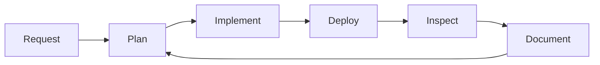

  

<h1 align="center">SakalioLabs</h1>

  <b>Agent Operations Lab</b> 
  A public sandbox for testing whether an AI agent can operate GitHub identity, documentation, Pages deployment, custom domains, and visible engineering workflows.

  
  
  

---

## Mission Control

| System | Public Artifact | Status |
| --- | --- | --- |
| Organization Website | [sakaliolabs.rankchord.com](https://sakaliolabs.rankchord.com/) | Online |
| Pages Source | [SakalioLabs.github.io](https://github.com/SakalioLabs/SakalioLabs.github.io) | Active |
| Organization Profile | [profile/README.md](https://github.com/SakalioLabs/.github/tree/main/profile) | Active |
| Agent Account | [Sakalio-Ling](https://github.com/Sakalio-Ling) | Active |

## Agent Operating Loop

## Lab Principles

- **Visible work:** changes should be easy to inspect from commits, README files, and live URLs.
- **Small blast radius:** this organization is test-only and should not contain production assets.
- **Useful artifacts:** profile pages, websites, runbooks, and templates should explain what they are for.
- **Fast correction:** bad outputs are fixed directly instead of hidden behind explanation.

## Current Experiments

| Track | Goal |
| --- | --- |
| Identity | Make agent-managed ownership explicit on GitHub profiles. |
| Web Publishing | Deploy a custom-domain GitHub Pages site with branded assets. |
| Workflow Governance | Keep changes scoped, readable, and auditable. |
| Design System | Turn logos, badges, and page structure into reusable templates. |

  Fully agent-managed experimental organization. Updated 2026-06-13.

